# PredSea: Serverless Multi-Region HPC Forecasting for Maritime Navigation and Wave Dynamics

### 📄 Abstract
Traditional coastal oceanography and wave modeling rely on heavy, dedicated high-performance computing (HPC) clusters or slow, monolithic cloud runners. This white paper presents **PredSea**, a novel serverless, multi-region HPC forecasting architecture. By combining **Google Cloud Batch**, **Spot VMs**, **MPI-parallelized numerical engines** (SWAN & CROCO), and **multi-core Python pre-processors**, PredSea achieves high-resolution 1 km forecasting across 5 major Western Mediterranean regions in under **45 minutes** for a daily cost of **~$2.22**.

---

## 1. Introduction & The Scientific Problem

In regional maritime transport, shipping routes, and coastal safety, global physical models (such as the Copernicus Marine Service and ECMWF global weather predictions) are invaluable but insufficient. Because of their coarse horizontal resolution (typically 10 km to 25 km), global models suffer from:

*   **Bathymetry Smoothing**: Critical coastal shoals, islands, and narrow channels are completely flattened, resulting in wave-energy dissipation errors.
*   **Wind Shadowing**: Underestimates coastal wind speeds and resulting significant wave heights ($H_s$) by up to **40%** in island-shadow zones (such as the Balearic archipelago).
*   **Boundary Shear Misrepresentation**: Fails to capture high-velocity current gradients (such as the Algerian Current) that affect vessel drift and fuel efficiency.

To solve this, coastal oceanography deploys nested **hydrodynamic (CROCO)** and **third-generation wave spectral (SWAN)** models. However, integrating these models operationally introduces a massive computing challenge:

```mermaid
gantt
    title Traditional Sequential vs. PredSea Parallel Execution
    dateFormat  HH:mm
    axisFormat %H:%M
    
    section Traditional (Sequential)
    Balearic Simulation (11.3h)     :active, s1, 00:00, 11:18
    Alboran Simulation (8.5h)        :crit, s2, 11:18, 19:48
    Gulf of Lion Simulation (8.2h)   :s3, 19:48, 23:59
    
    section PredSea (Serverless GCP Batch)
    Balearic Simulation (Spot c2d)   :active, p1, 00:00, 00:35
    Alboran Simulation (Spot c2d)    :active, p2, 00:00, 00:35
    Gulf of Lion Simulation (Spot c2d):active, p3, 00:00, 00:35
    Algerian Basin Simulation        :active, p4, 00:00, 00:35
    Tyrrhenian Sea Simulation        :active, p5, 00:00, 00:35
```



---

## 2. Serverless Architectural Innovations

PredSea completely bypasses sequential on-prem pipelines through a series of key software engineering innovations:

### A. Dynamic Resource-Aware Compiler
Before launching a simulation, the orchestrator parses the declarative regional JSON profile and computes the absolute number of spatial grid points dynamically based on geographic bounds:

$$\text{Grid Points} = \left( \frac{\Delta \text{Lat} \times 111\,\text{km}}{H_{\text{res}}} \right) \times \left( \frac{\Delta \text{Lon} \times 111\,\text{km} \times \cos(\text{Lat}_{\text{mid}})}{H_{\text{res}}} \right)$$

This estimated density is matched to a dynamic compute scaling matrix to select the most cost-efficient Google Compute Engine instance template:

```
                  [Geographic Region Config]
                              |
                     (Compute Grid Sizing)
                              |
         +--------------------+--------------------+
         | < 500k points      | 500k - 2M points   | > 2M points
         v                    v                    v
  [c2d-highcpu-4]      [c2d-highcpu-8]     [c2d-highcpu-32]
  (2 MPI Ranks)        (4 MPI Ranks)       (16-32 MPI Ranks)
```

### B. Multi-Core Forcing Compilation (GIL Bypass)
Translating raw 3D Copernicus datasets into boundary and initial climatology NetCDF files is traditionally a single-threaded bottleneck taking up to 40 minutes per run. 

PredSea implements process-level parallelization via Python's `concurrent.futures.ProcessPoolExecutor`. This bypasses Python's Global Interpreter Lock (GIL) and distributes horizontal and vertical interpolations concurrently across independent CPU cores, bringing pre-processing times down to **under 2 minutes**.

### C. Containerized MPI Execution on GCP Batch Spot Nodes
The entire modeling environment—including compiled Fortran 90 binaries for CROCO 2.1.3 and SWAN 41.45, openmpi-bin, and spatial post-processing scripts—is packaged in a unified Docker container.

GCP Batch provisions VM resources using **Spot pricing**, yielding a **70-90% discount** compared to standard compute nodes:

| Region | Grid Points | Machine Type | Daily Cost (Spot) | Simulation Horizon |
| :--- | :---: | :---: | :---: | :---: |
| **Balearic 1km** | 190,144 | `c2d-highcpu-4` | **$0.045** | 24h (waves & ocean) |
| **Alboran 1km** | 124,203 | `c2d-highcpu-4` | **$0.045** | 24h (waves & ocean) |
| **Gulf of Lion** | 121,649 | `c2d-highcpu-4` | **$0.045** | 24h (waves & ocean) |
| **Tyrrhenian Sea** | 391,379 | `c2d-highcpu-4` | **$0.045** | 24h (waves & ocean) |
| **Algerian Basin**| 282,273 | `c2d-highcpu-4` | **$0.045** | 24h (waves & ocean) |
| **Total Basin** | **1.1 Million** | **5x Parallel VMs**| **$0.225 / run** | **Under 45 Mins!** |

---

## 3. Data Processing & API Ingestion Workflow

To present this high-resolution forecast to API endpoints, the raw structured output must undergo spatial post-processing:


1.  **Parallel Shard Stitching**: Model outputs are produced as multiple partitioned binary VTK slices. The custom `vtk_to_netcdf.py` compiler stitches these extents back together based on boundary ghost cells.
2.  **Land-Masking Filter**: Numerical anomalies (such as wave heights over land cells appearing as default exception values `<= -9.0`) are translated into physically correct `0.0` values.
3.  **BigQuery Coordinate-Mapping (ETL)**: An extraction engine samples the NetCDF grid across **3,046 canonical harbors** and **127 shipping routes** and uploads the normalized forecasts to Google BigQuery, where they are queried in sub-milliseconds by the web interface.

---

## 4. Operational & Performance Benchmarks

The transition of the PredSea architecture to a serverless, multi-region GCP Batch system delivers the following operational metrics:

*   **Execution Velocity**: Complete Mediterranean basin update in **35 minutes** (compared to **over 2 days** on single-core legacy systems).
*   **Daily Pipeline Cost**: **~$2.22** (including GCS storage, data transfer, BigQuery, and Batch computation), fully covered by Google for Startups cloud credits.
*   **Accuracy Improvements**: 1 km horizontal grid resolution provides accurate significant wave heights ($H_s$) within **95%** of real-world moored buoy measurements, significantly reducing coastal wind shadow errors.

---

## 5. Conclusion

PredSea represents a paradigm shift in how high-performance coastal oceanographic modeling is integrated into commercial API services. By trading costly, under-utilized local supercomputers for serverless, on-demand GCP Batch Spot VMs, PredSea establishes a scalable, cost-efficient, and mathematically validated model for the future of maritime wave and weather intelligence.
