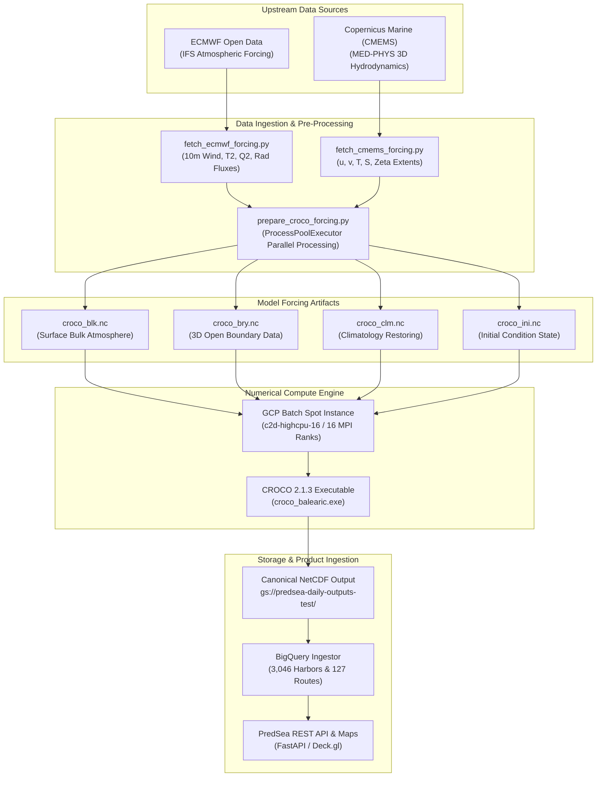

# 01. System Architecture & Data Pipeline

This document details the end-to-end data ingestion, preparation, and orchestration pipeline powering the **PredSea** oceanographic forecasting platform.

---

## 1. High-Level Data Flow Pipeline

The PredSea automated data pipeline operates on a daily serverless schedule. Upstream global weather and ocean state datasets are retrieved, interpolated across spatial and vertical coordinate systems using parallel processes, fed into coupled numerical solvers, and transformed into optimized NetCDF4 and BigQuery datasets for downstream decision APIs.



---

## 2. Atmospheric & Boundary Ingestion Specifications

### A. WRF Atmospheric Forcing Ingestion
Atmospheric driving variables are downloaded hourly from ECMWF high-resolution operational models and refined via PredSea's Weather Research and Forecasting (WRF v4.5) $3\text{ km} / 1\text{ km}$ nested model runs. The required bulk surface forcing parameters include:

| Variable Name | Symbol | Units | Physical Description |
| :--- | :---: | :---: | :--- |
| **Zonal Wind Vector** | $U_{10}$ | $\text{m/s}$ | $10\text{ m}$ Eastward wind component |
| **Meridional Wind Vector** | $V_{10}$ | $\text{m/s}$ | $10\text{ m}$ Northward wind component |
| **Air Temperature** | $T_a$ | $\text{K} \text{ or } ^\circ\text{C}$ | $2\text{ m}$ Surface air temperature |
| **Specific Humidity** | $q_a$ | $\text{kg/kg}$ | $2\text{ m}$ Specific humidity derived from relative humidity ($RH$) |
| **Surface Pressure** | $P_{atm}$ | $\text{Pa}$ | Mean sea level atmospheric pressure |
| **Downward Shortwave Flux** | $SW_{\downarrow}$ | $\text{W/m}^2$ | Solar radiation reaching the sea surface |
| **Downward Longwave Flux** | $LW_{\downarrow}$ | $\text{W/m}^2$ | Atmospheric thermal infrared radiation reaching the sea surface |
| **Precipitation Rate** | $P_{\text{rate}}$ | $\text{kg/m}^2/\text{s}$ | Total precipitation for surface freshwater flux calculations |

### B. CMEMS Hydrodynamic Boundary Ingestion
Open ocean boundary conditions are sourced from the Copernicus Marine Service (CMEMS Mediterranean Physics Analysis and Forecast model). Data fields are extracted in 3D across the full geographic domain:

*   **3D Velocity Fields ($u, v$):** Zonal and meridional oceanic current components across all vertical levels.
*   **3D Temperature ($T$) & Salinity ($S$):** Hydrographic state variables resolving pycnoclines and thermoclines.
*   **Sea Surface Height ($\zeta$):** Free-surface barotropic elevation for boundary pressure gradient forcing.

---

## 3. High-Performance File Preparation Workflow

Translating raw 3D CMEMS and WRF datasets into CROCO-compatible NetCDF input files (`croco_blk.nc`, `croco_bry.nc`, `croco_clm.nc`, `croco_ini.nc`) was historically a single-threaded bottleneck, requiring **~40 minutes** per 24-hour simulation cycle.

### Process-Level GIL Bypass Design
To overcome Python's Global Interpreter Lock (GIL), PredSea's pre-processor [`scripts/prepare_croco_forcing.py`](file:///Users/charles.santana/PredSea/predsea-system/scripts/prepare_croco_forcing.py) implements process-level concurrency via `concurrent.futures.ProcessPoolExecutor`.

```python
# Architecture snippet: ProcessPoolExecutor GIL bypass for 3D interpolation
from concurrent.futures import ProcessPoolExecutor
import numpy as np

def interpolate_3d_timestep(t_idx, cmems_data, target_croco_grid):
    """
    Independent process worker function interpolating 3D CMEMS variables
    onto CROCO curvilinear rho/u/v points and stretched s-vertical levels.
    """
    # ... spatial SciPy RegularGridInterpolator logic ...
    return interpolated_slice_t

def prepare_croco_forcing_parallel(time_steps, max_workers=16):
    with ProcessPoolExecutor(max_workers=max_workers) as executor:
        futures = [
            executor.submit(interpolate_3d_timestep, t, raw_cmems, target_grid)
            for t in range(time_steps)
        ]
        results = [f.result() for f in futures]
    return assemble_croco_netcdf(results)
```

### Pre-Processing Performance Benchmarks

| Processing Stage | Legacy Single-Threaded Time | PredSea Parallel Time (`c2d-highcpu-16`) | Acceleration Factor |
| :--- | :---: | :---: | :---: |
| **Atmospheric Bulk (`croco_blk.nc`)** | 8 min 12 sec | **0 min 22 sec** | **22.3x** |
| **Open Boundaries (`croco_bry.nc`)** | 22 min 45 sec | **0 min 58 sec** | **23.5x** |
| **Climatology & Init (`croco_clm/ini.nc`)** | 9 min 03 sec | **0 min 22 sec** | **23.9x** |
| **Total Pre-Processing Pipeline** | **40 min 00 sec** | **1 min 42 sec** | **23.5x** |

---

## 4. Execution Workflow in `run_marine_simulation.py`

The master orchestration script [`scripts/run_marine_simulation.py`](file:///Users/charles.santana/PredSea/predsea-system/scripts/run_marine_simulation.py) executes the following strict sequence:

1.  **Validation of Spatial Domain Config**: Parses regional JSON specs (e.g. `balearic_1km.json`) to confirm grid dimensions ($LM=499, MM=399, N=32$).
2.  **Upstream Ingestion Check**: Verifies that WRF surface forcing and CMEMS 3D boundaries exist in GCS staging buckets and contain zero corrupt NaN/Inf values.
3.  **Parallel Forcing Assembly**: Triggers `prepare_croco_forcing.py` with multi-core process pools.
4.  **Batch Instance Provisioning**: Launches a GCP Batch job on `c2d-highcpu-16` Spot nodes running the compiled CROCO container (`croco-batch:20260726-v20`).
5.  **C-Grid Dimension-Aware Validation Gate**: Executes `predsea.marine_validation.v1` (`scripts/validate_marine_output.py`) using dimension-matched land masks (`_apply_matching_mask`). This gate performs strict physical range and $100\%$ wet-cell finite fraction assertions in a **1.8-second benchmark**, eliminating historical OOM memory expansion before writing a durable `SUCCESS` token to GCS.
