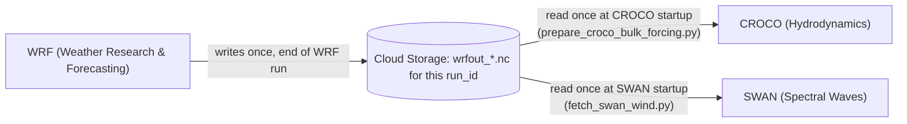

# 02. Core Numerical Engines & Current Data-Exchange Pipeline

This document provides a mathematical and functional analysis of the core numerical modeling engines integrated into the **PredSea** forecasting suite: **WRF** (atmospheric dynamics), **CROCO** (hydrodynamics), and **SWAN** (spectral wave dynamics).

**Important scope note:** the three models are currently run as independent, one-way, file-mediated stages, not as a live-coupled OASIS3-MCT/COAWST system. WRF runs once per forecast cycle and writes its output to Cloud Storage; CROCO and SWAN each read that output as static forcing and run independently (optionally as two steps inside the same Batch job via `--model both`, but without runtime field exchange between them). Dynamic two-way/three-way coupling (wave radiation stress feeding back into CROCO, CROCO currents feeding back into SWAN's refraction, live SST feedback into WRF) is designed-for but not yet implemented — see the roadmap in `06_conclusion_and_roadmap.md`, Milestone B.

---

## 1. Core Numerical Modeling Engines

```
+-----------------------------------------------------------------------------------+
|                            PredSea Modeling Suite (current, one-way)               |
|                                                                                   |
|  +--------------------+                                                           |
|  |     WRF v4.5       |                                                           |
|  |  (Atmosphere)      |  runs once per forecast cycle on a single Spot VM         |
|  +---------+----------+                                                           |
|            |                                                                     |
|            v  writes wrfout_*.nc to GCS (this run's own output prefix)           |
|  +-----------------------------------------------------------------------------+  |
|  |                    Cloud Storage (static per-run forcing files)              |  |
|  +---------+-----------------------------------------------+---------------------+  |
|            |                                               |                     |
|            v  read once at startup                          v  read once at startup|
|  +--------------------+                              +-------------------------+  |
|  |    CROCO v2.1.3    |                              |       SWAN v41.45       |  |
|  |  (Hydrodynamic 1km)|                              |  (Spectral Waves 1km)   |  |
|  +--------------------+                              +-------------------------+  |
|   Runs independently, one region per GCP Batch job (5 parallel regional shards)    |
+-----------------------------------------------------------------------------------+
```

### A. WRF (Weather Research and Forecasting Model)
The atmospheric component runs WRF v4.5, solving the fully compressible, non-hydrostatic Euler primitive equations on a Arakawa-C grid using terrain-following hydrostatic pressure vertical coordinates ($\eta$).

*   **Primary Governing Variables**: 3D velocity vectors ($\vec{u}_a$), perturbation potential temperature ($\theta'$), geopotential ($\phi'$), and surface pressure ($P_{atm}$).
*   **Physical Parameterizations**:
    *   **Microphysics**: WSM6 (WRF Single-Moment 6-class scheme).
    *   **Planetary Boundary Layer (PBL)**: YSU (Yonsie University scheme) resolving atmospheric turbulence and surface momentum flux closure.
    *   **Radiation**: RRTMG longwave and shortwave schemes computing surface downward fluxes ($SW_{\downarrow}, LW_{\downarrow}$).
*   **Output Parameters**: Provides $10\text{ m}$ wind vectors ($U_{10}, V_{10}$), $2\text{ m}$ air temperature ($T_a$), specific humidity ($q_a$), surface pressure ($P_{atm}$), and radiative fluxes ($SW_{\downarrow}, LW_{\downarrow}$).

### B. CROCO (Coastal and Regional Ocean Community Model)
CROCO v2.1.3 is a free-surface, hydrostatic/non-hydrostatic 3D primitive equation hydrodynamic model evolved from ROMS. It uses an Arakawa-C grid in the horizontal and a general curvilinear, terrain-following $s$-vertical coordinate system in the vertical.

#### Hydrodynamic Governing Equations
In Cartesian/curvilinear coordinates with terrain-following $s$-levels, the Reynolds-averaged Navier-Stokes (RANS) momentum equations under the Boussinesq and hydrostatic approximations are:

$$\frac{\partial u}{\partial t} + \vec{v} \cdot \nabla u - f v = -\frac{1}{\rho_0} \frac{\partial p}{\partial x} + \frac{\partial}{\partial z} \left( K_m \frac{\partial u}{\partial z} \right) + \mathcal{D}_u$$

$$\frac{\partial v}{\partial t} + \vec{v} \cdot \nabla v + f u = -\frac{1}{\rho_0} \frac{\partial p}{\partial y} + \frac{\partial}{\partial z} \left( K_m \frac{\partial v}{\partial z} \right) + \mathcal{D}_v$$

$$\frac{\partial p}{\partial z} = -\rho g$$

$$\frac{\partial u}{\partial x} + \frac{\partial v}{\partial y} + \frac{\partial w}{\partial z} = 0$$

Where:
*   $u, v, w$ are the 3D fluid velocity components in $x, y, z$.
*   $f = 2\Omega \sin\phi$ is the Coriolis parameter.
*   $\rho_0$ is the reference ocean water density ($1025\text{ kg/m}^3$).
*   $K_m$ is the vertical eddy viscosity derived from GLS (Generic Length Scale) $k$-$\epsilon$ or $k$-$\omega$ turbulence closure.
*   $\mathcal{D}_u, \mathcal{D}_v$ represent horizontal viscosity and dissipation operator terms.

#### Stretched $s$-Vertical Coordinate System
To resolve both deep ocean circulation and shallow coastal boundary layers, CROCO employs a non-linear vertical transformation (`NEW_S_COORD`):

$$z(x, y, s) = \zeta(x, y) + [\zeta(x, y) + h(x, y)] \cdot S(x, y, s)$$

Where the non-linear stretching function $S(x, y, s)$ is governed by parameters $\theta_s$ (surface stretching), $\theta_b$ (bottom stretching), and $h_c$ (critical depth):

$$S(x, y, s) = \frac{h_c s + h C(s)}{h_c + h}$$

In the reference Balearic grid ($401 \times 501$ horizontal grid at $1\text{ km}$ resolution), $N=32$ vertical layers are configured with $\theta_s = 6.0$, $\theta_b = 0.0$, and $h_c = 10\text{ m}$.

### C. SWAN (Simulating WAves Nearshore)
SWAN v41.45 is a third-generation spectral wave model that computes the evolution of the 2D wave action density spectrum $N(\sigma, \theta; x, y, t)$ over coastal and shelf sea environments:

$$N(\sigma, \theta) = \frac{E(\sigma, \theta)}{\sigma}$$

Where $\sigma$ is the relative wave intrinsic frequency and $\theta$ is the wave propagation direction.

#### Spectral Action Balance Equation
The governing wave transport equation in absolute Cartesian coordinates is given by:

$$\frac{\partial N}{\partial t} + \frac{\partial}{\partial x} (c_x N) + \frac{\partial}{\partial y} (c_y N) + \frac{\partial}{\partial \sigma} (c_\sigma N) + \frac{\partial}{\partial \theta} (c_\theta N) = \frac{S_{tot}}{\sigma}$$

Where:
*   $(c_x, c_y) = \vec{c}_g + \vec{U}$ are the spatial propagation velocity components (group velocity $\vec{c}_g$ plus background current vector $\vec{U}$).
*   $c_\sigma, c_\theta$ represent the propagation speeds in spectral frequency $\sigma$ and direction $\theta$ (resolving current refraction and depth-induced shoaling).
*   $S_{tot}$ is the total source/sink term:

$$S_{tot} = S_{in} + S_{nl3} + S_{nl4} + S_{ds} + S_{bot} + S_{db}$$

Where $S_{in}$ is wind input, $S_{nl3}, S_{nl4}$ are 3-wave (triad) and 4-wave (quadruplet) non-linear interactions, $S_{ds}$ is whitecapping dissipation, $S_{bot}$ is bottom friction, and $S_{db}$ is depth-induced wave breaking.

---

## 2. Current Data Exchange: One-Way, File-Mediated Forcing

Today, WRF, CROCO, and SWAN exchange information only through static files written to Cloud Storage — there is no live in-memory field exchange during a run. The two currently active paths are:



1.  **WRF → CROCO (one-way, file-based)**: `prepare_croco_bulk_forcing.py` reads the completed `wrfout_d02_*.nc` (or `d03` for Balearic's finer nest) sequence and builds a static `croco_blk.nc` atmospheric bulk-forcing file before CROCO starts. CROCO does not read live WRF output and WRF does not read anything back from CROCO — there is no dynamic SST feedback into WRF yet.
2.  **WRF → SWAN (one-way, file-based)**: SWAN reads 10 m wind fields from the same completed WRF output to drive spectral wave growth. SWAN's own output (wave-driven roughness, radiation stress) is not fed back into WRF or CROCO at runtime.
3.  **CROCO ↔ SWAN**: currently **not connected at all**, even one-way. Both read WRF wind/atmospheric forcing independently and run to completion independently (they may share a single GCP Batch job via `run_marine_simulation.py --model both`, but that only means "run CROCO, then run SWAN, in the same container" — not a coupled exchange of currents, sea level, or radiation stress).

## 3. Planned Two-Way / Three-Way Coupling (Roadmap, Not Yet Built)

The exchange matrix below describes the **target** architecture once dynamic OASIS3-MCT-style coupling is implemented (tracked as Milestone B in `06_conclusion_and_roadmap.md`). None of these feedback paths exist in the current pipeline; they are included here to document the intended design, not current capability.

| Source Model | Target Model | Exchange Variable | Symbol / Units | Physical Coupling Effect |
| :--- | :--- | :--- | :---: | :--- |
| **WRF** | **CROCO** | Surface Stress & Heat Flux | $\tau, \text{shflux}$ ($\text{N/m}^2, \text{W/m}^2$) | Drives Ekman currents & water column thermal structure |
| **CROCO** | **WRF** | Sea Surface Temperature | $\text{SST}$ ($^\circ\text{C}$) | Modulates atmospheric boundary layer stability & flux coefficients |
| **SWAN** | **CROCO** | Wave Height, Period & $U_{bot}$ | $H_s, T_p, U_{bot}$ ($\text{m}, \text{s}, \text{m/s}$) | Drives wave radiation stresses & bottom friction enhancement |
| **CROCO** | **SWAN** | Currents & Sea Surface Height | $u, v, \zeta$ ($\text{m/s}, \text{m}$) | Causes Doppler shift, wave refraction, & depth-induced breaking |
| **SWAN** | **WRF** | Surface Roughness Length | $z_0$ ($\text{m}$) | Adjusts atmospheric surface drag based on real wave state |
| **WRF** | **SWAN** | $10\text{ m}$ Surface Wind Vectors | $U_{10}, V_{10}$ ($\text{m/s}$) | Governs spectral wave energy generation ($S_{in}$) |

*(WRF → SWAN wind forcing, the last row, is the one exchange in this table that is already real today — see Section 2.)*

---

## 4. Regional Domain Decomposition & Lateral Ocean Boundary Forcing

The discussion above concerns coupling *between models* (WRF, CROCO, SWAN) at a single location. This section addresses a separate question: how the ocean domain itself is decomposed in space, and how the Atlantic inflow at the Strait of Gibraltar and the Eastern Mediterranean exchange near the Strait of Messina are represented.

**PredSea does not run one continuous Mediterranean-wide ocean model.** CROCO and SWAN each run as five independent, non-communicating regional instances, one per GCP Batch job, each confined to its own fixed rectangular bounding box defined in `simulation/marine/regions/{region}.json`:

| Region | Longitude range | Latitude range | Grid (`xi_rho` × `eta_rho`) |
| :--- | :---: | :---: | :---: |
| Alboran | $-6.0^\circ$ to $-1.0^\circ$ | $35.0^\circ$ to $37.5^\circ$ | $501 \times 251$ |
| Algerian | $-1.0^\circ$ to $8.5^\circ$ | $35.0^\circ$ to $38.0^\circ$ | $951 \times 301$ |
| Balearic | $0.5^\circ$ to $5.5^\circ$ | $37.5^\circ$ to $41.5^\circ$ | $501 \times 401$ |
| Gulf of Lion | $2.0^\circ$ to $6.5^\circ$ | $41.5^\circ$ to $43.3^\circ$ | $500 \times 200$ |
| Tyrrhenian | $7.5^\circ$ to $14.0^\circ$ | $38.0^\circ$ to $44.5^\circ$ | $650 \times 651$ |

All five run at $1000\text{ m}$ horizontal resolution ($N=32$ vertical $s$-levels).

*Gulf of Lion's latitude range and grid dimensions above reflect a 2026-07-29 bbox resize (see Section 4.4); its previous extent was $41.5^\circ$–$44.5^\circ\text{N}$ at $451 \times 301$, and that older grid is what the CROCO 6h/24h gate passes recorded in `04_empirical_validation.md` were run against. The new $500 \times 200$ grid has not yet been re-validated at any CROCO horizon.*

### 4.1 Lateral boundary forcing: an external product, not a PredSea coupling

Each region's `forcing.ocean_initial_and_boundary` and `forcing.wave_open_boundary` fields (region profile schema) are set to `"cmems"`: every region's initial condition and open lateral boundaries are built exclusively from Copernicus Marine Service (CMEMS) Mediterranean reanalysis/forecast products, fetched independently per region by `fetch_native_marine_forcing.py`:

* `cmems_mod_med_phy-cur_anfc_4.2km-3D_PT1H-m` ($u_o, v_o$ — currents)
* `cmems_mod_med_phy-tem_anfc_4.2km-3D_PT1H-m` ($\theta_o$ — temperature)
* `cmems_mod_med_phy-sal_anfc_4.2km-3D_PT1H-m` ($S_o$ — salinity)
* `cmems_mod_med_phy-ssh_anfc_4.2km-2D_PT1H-m` ($\zeta$ — sea surface height)
* `cmems_mod_med_wav_anfc_4.2km_PT1H-i` ($H_{m0}, T_p, \theta_{mean}$ — SWAN boundary spectrum)

`prepare_croco_forcing.py` interpolates this $4.2\text{ km}$ CMEMS state horizontally onto the region's own $1\text{ km}$ grid, then extracts the four edges of that interpolated field as CROCO's `croco_bry.nc` open-boundary values:

```python
sides = {
    "west":  (0, slice(None), "eta_rho", "eta_u", "eta_v"),
    "east":  (-1, slice(None), "eta_rho", "eta_u", "eta_v"),
    "south": (slice(None), 0, "xi_rho", "xi_u", "xi_v"),
    "north": (slice(None), -1, "xi_rho", "xi_u", "xi_v"),
}
for side, (ii, jj, rho_axis, u_axis, v_axis) in sides.items():
    bry_vars[f"zeta_{side}"] = (..., zeta_clm_pad[:, jj, ii])
    bry_vars[f"u_{side}"]    = (..., u_clm_pad[:, :, jj, ii])
    ...
```

This is the mechanism — and the *only* mechanism — through which the Atlantic and the Eastern Mediterranean influence any PredSea region. Neither ocean basin is itself simulated by PredSea; both enter purely as boundary values sourced from the coarser, externally-computed $4.2\text{ km}$ CMEMS Mediterranean product.

### 4.2 Gibraltar and Messina: one resolved directly, one not represented

The Strait of Gibraltar ($\approx -5.6^\circ$ to $-5.3^\circ$ lon, $35.9^\circ$–$36.0^\circ$ lat) falls **inside** the Alboran region's own bounding box. The Atlantic–Mediterranean exchange there is therefore resolved directly, at $1\text{ km}$ resolution, by Alboran's own CROCO grid — it is an internal feature of that domain, not a boundary condition. The water properties entering at Gibraltar are, however, still sourced from the $4.2\text{ km}$ CMEMS product at Alboran's own western boundary, since PredSea does not simulate the Atlantic basin itself.

The Strait of Messina ($\approx 15.6^\circ$ lon, $38.2^\circ$ lat) falls **outside** all five regions — the Tyrrhenian domain's eastern edge stops at $14.0^\circ$, short of the strait. No PredSea region resolves the Sicily/Ionian exchange directly at $1\text{ km}$; whatever occurs there is represented only implicitly, through whatever the $4.2\text{ km}$ CMEMS product supplies at the Tyrrhenian domain's eastern boundary. This is a genuine coverage gap in the current 5-region configuration, not a modeling choice with an explicit fallback.

### 4.3 No region-to-region coupling exists today

Several of the five bounding boxes are geometrically adjacent, and two — Algerian ($lon \le 8.5^\circ$, $lat \le 38.0^\circ$) and Balearic ($lon \ge 0.5^\circ$, $lat \ge 37.5^\circ$) — actually **overlap** over the shared rectangle $lon \in [0.5^\circ, 5.5^\circ]$, $lat \in [37.5^\circ, 38.0^\circ]$. This adjacency is coincidental to how the bounding boxes were drawn; it is not exploited by any coupling mechanism. A repository-wide search found no code path that passes one region's simulated CROCO/SWAN state to another region's boundary — `prepare_croco_forcing.py` takes no `region_id` of a neighboring domain and reads only the current region's own CMEMS-derived climatology.

Practically, this means:

* Each region is boundary-forced only by the external CMEMS field, never by a sibling PredSea region's own (higher-resolution) output.
* In the Algerian/Balearic overlap area, the two regions produce two independently-computed answers for the same physical patch of sea; there is no reconciliation between them.
* This is architecturally a **one-way boundary-nesting** design (fine regional models forced by a coarser external background field) rather than a coupled multi-region basin simulation. Extending it to true region-to-region coupling, or to a single continuous domain covering Gibraltar through Messina, is not on the current roadmap (see `06_conclusion_and_roadmap.md`) but is a natural direction for closing the Messina coverage gap described in 4.2.

### 4.4 Bounding boxes are rectangles, not coastline-following polygons — some edges land on land

Every region's bbox is a simple lon/lat rectangle (Section 4, table above), not a shape traced to the coastline. For open-basin regions (Alboran, Algerian) this is largely inconsequential — the whole rectangle is water well away from land. Gulf of Lion, a bay-shaped region, is the case that actually hit this: its original bbox's northern edge (latitude $44.5^\circ$) sat well past the real French Mediterranean coastline in that longitude band, on land near Marseille/Toulon. Since CMEMS's wave product is masked (NaN) over land, that entire edge row had zero valid ocean cells.

This was found during the current validation cycle, not designed for in advance: `gulf_of_lion_1km`'s SWAN job failed with `north wave boundary has no finite values at index 0` even after the region-scoped-cache fix in 4.3 confirmed it was reading its own, correctly-fetched wave data — the data was real, the bbox was real, the edge itself was just land.

The first fix attempt (2026-07-29) kept the bbox as-is and had `_side_series` in `scripts/prepare_swan_run.py` walk inward from a land-masked edge, row by row (or column by column), until it found the nearest row/column with real ocean data, using that as the boundary condition and logging how many cells inward it had to go. That approach was silently accepting arbitrarily deep inland substitutions, though, so it was tightened the same day: `_side_series` now raises an explicit error whenever the inward walk exceeds 30% of that edge's grid size, on the reasoning that a walk that deep means the bbox itself is drawn wrong for that side, not something to silently patch over with an unrepresentative, deep-inland value (see Section 4.5 for the related SWAN numerics fix).

That tightened check is what caught the real problem: a 2026-07-29 validation test (rebuilt image, `alboran_1km`/`gulf_of_lion_1km`/`algerian_1km` only) had `gulf_of_lion_1km`'s SWAN job fail fast, within about 2.5 minutes, on the new explicit error — confirming that its north edge at $44.5^\circ$ sat 36% of the way inland (into mainland France) before reaching any open water, i.e. its open boundary condition had genuinely been built from land-adjacent water, not the true open sea. As a result, `gulf_of_lion_1km.json`'s `bbox.latitude_max` was reduced from $44.5^\circ$ to $43.3^\circ$, pulling the domain's north edge off the mainland toward the actual coastline near Marseille/Toulon (Section 4's region table above reflects this new extent). The CROCO grid was regenerated for the new bbox and the region's SWAN bathymetry was regenerated against it too; the region's compiled CROCO binary was rebuilt with the regenerated grid's dimensions as confirmed directly from the output NetCDF (`xi_rho=500, eta_rho=200`, i.e. `LM=498, MM=198` under CROCO/ROMS's `xi_rho=LM+2`/`eta_rho=MM+2` convention, replacing a previous `LM=449, MM=299` that itself traced back to a rough planning estimate rather than a confirmed grid dimension) — see `05_cloud_deployment_and_ops.md` for the image rebuild this shipped in.

Whether the 30%-of-grid threshold is the right cutoff for other regions, and whether any other region's bbox has a similar undetected land-adjacent edge, has not been checked — this was found and fixed for Gulf of Lion specifically, not audited across all 5 regions.

### 4.5 SWAN slow convergence in geometrically constrained regions

During the same 2026-07-29 live 6-hour-forecast test, 3 of the 5 regions' SWAN jobs (`alboran_1km`, `gulf_of_lion_1km`, `algerian_1km`) ran for multiple hours without completing, while `balearic_1km` and `tyrrhenian_1km` finished quickly. Grid size was ruled out as the explanation: `tyrrhenian_1km` has the largest grid of the five ($\approx 523{,}000$ cells) and finished fastest, while `alboran_1km`/`gulf_of_lion_1km` have among the smallest grids ($\approx 150{,}000$–$170{,}000$ cells) and were among the slow ones. The SWAN 41.51 user manual was consulted directly and confirms nonstationary runs default to `mxitns=1` (max 1 iteration per timestep), which rules out "excessive iteration churn per timestep" as the cause.

SWAN's numerical configuration — a 5-minute computational timestep, `GEN3 WESTHUYSEN` wave growth, and `BREAKING`/`FRICTION`/`TRIAD` physics terms — had been hardcoded identically across all 5 regions with no accommodation for geometrically constrained domains (narrow straits, bay shapes, steep coastal shelves). The fix adds `PROP BSBT` to the SWAN command file generated for every region: this is SWAN's own manual-documented recommendation ([swanmodel.sourceforge.io, node29](https://swanmodel.sourceforge.io/online_doc/swanuse/node29.html)) for domains where "sharp transitions in the grid cannot be avoided" — exactly the geometry of `alboran_1km` (Strait of Gibraltar), `gulf_of_lion_1km` (bay-shaped, steep shelf break), and `algerian_1km` (narrow coastal shelf), as opposed to `balearic_1km`/`tyrrhenian_1km`, which have open-water boundaries throughout.

**Current status: not yet confirmed resolved.** A 3-region-only validation test (`alboran_1km`, `gulf_of_lion_1km`, `algerian_1km`) with the rebuilt image found `gulf_of_lion_1km`'s SWAN job failing fast (within ~2.5 minutes) on the new boundary error described in Section 4.4 — a genuine, previously-silent problem, now addressed by the bbox resize. `alboran_1km` and `algerian_1km` did not fail fast this time, but also did not cleanly finish: both ran for 3.5+ hours before being orphaned when the overall build aborted due to `gulf_of_lion_1km`'s failure (any region failing aborts the whole run — see `05_cloud_deployment_and_ops.md`, Section 1a). This is an inconclusive, mixed result for `alboran_1km`/`algerian_1km` specifically — better than an immediate crash, but not yet confirmed as fully resolved.

A leading but **unconfirmed, not yet investigated** theory for residual slowness in those two regions is MPI domain-decomposition load imbalance: narrow/constrained-geometry regions have large land fractions inside their rectangular bounding box, and if GCP Batch's grid decomposition doesn't account for the wet/dry cell distribution, some MPI ranks could be doing far more work than others. This has not been tested.

A fresh 3-region validation test (`alboran_1km`, `gulf_of_lion_1km`, `algerian_1km`) with the fully-fixed image (bbox resize + `PROP BSBT` + the boundary-walk-inward limit) is in progress as of this writing (Cloud Build ID `a8b61b91-2302-4d24-81ad-70f64951922e`, started 2026-07-29T14:41:36Z). Its result is not yet known.

---

## 5. Wave Model Migration: SWAN → WaveWatch III (WW3)

As of 2026-08-04, SWAN is being replaced by WaveWatch III (WW3) as PredSea's wave-spectral engine, project-wide across all 5 regions — a full replacement, not a hybrid, to keep one uniform solver/architecture across regions. This section documents the migration's motivation and current status; it does not retract Sections 1.C/4.4/4.5 above, which remain the accurate description of SWAN's role while the migration is in progress.

### 5.1 Why

Five independent variables were tried and ruled out as the cause of the persistent non-convergence ("stuck at output request 1") affecting `alboran_1km`, `gulf_of_lion_1km`, and `algerian_1km` in both basin-wide and per-region SWAN configurations: bathymetry data quality (validated against GSHHG ground truth, 0.3–0.8% mismatch everywhere, no worse for the broken regions), resolution/timestep, physics scheme (WESTHUYSEN vs. KOMEN), MPI rank count/load balance, and domain size (a standalone small-domain `alboran_1km` job hit the identical symptom). The full elimination sequence is in `docs/ww3-migration-plan-2026-08-04.md`. The evidence points at something structural to SWAN's implicit solver on this specific coastline/bathymetry geometry, not a tunable setting.

WW3 uses an explicit propagation scheme built for basin/ocean-scale domains — the opposite design point from SWAN's implicit solver — computing the same wave-action-balance physics described in Section 1.C via a different numerical path, so it is not subject to the same failure mode.

### 5.2 Status as of 2026-08-05

- WW3 built from source (`Dockerfile.ww3-batch`, `ST4`/Ardhuin et al. (2010) physics package, MPI-enabled) and pushed to `europe-west1-docker.pkg.dev/predsea-api/predsea-simulations/ww3-batch`.
- A single-region 6h smoke test on `alboran_1km` (64 vCPU) completed successfully — the first confirmation WW3 runs to completion and produces sane output on the region that originally motivated the migration.
- A first 5-region breadth test (all of `alboran`, `algerian`, `balearic`, `tyrrhenian`, `gulf_of_lion`, uniform 16 vCPU each, 30-minute wall-clock budget) failed everywhere on a pure GCP Batch timeout (exit 50005) — 16 vCPU was too few cores to finish a 6h run in 30 minutes for any region, not a solver-level failure.
- A corrected 5-region breadth test — vCPU allocation made proportional to each region's actual sea-point count (from `ww3_grid`'s own grid statistics, not bbox size: 24/16/12/8/4 vCPU for tyrrhenian/balearic/algerian/alboran/gulf_of_lion respectively), `maxRunDuration` extended to 3 hours, and a periodic background log re-upload added so a run leaves diagnostic evidence even under a future timeout — **completed successfully for all 5 regions**, with completion times ranging 1.39h–2.03h. This is the first evidence the migration is sound across the full regional set, not only the region that motivated it.
- A 24-hour, 5-region forecast test, using WRF's own output as WW3's wind forcing (rather than the ECMWF Open Data shortcut used for the 6h tests), is the immediate next validation step. It is currently blocked on a WRF domain-coverage fix (alboran_1km's western ~40% fell outside WRF's own atmospheric domain) whose corrected image is being rebuilt.

The full narrative — exact job names, timings, resource configs, and concrete next steps — is kept in a dated handoff document rather than duplicated here, since this is an actively moving migration: see `docs/agent-handoff-ww3-wrf-migration-2026-08-05.md`.

### 5.3 What does not change

Section 4's discussion of regional domain decomposition, CMEMS-sourced lateral boundary forcing, and the absence of region-to-region coupling applies identically to WW3 — this migration replaces the wave solver only, not the boundary-forcing or domain-decomposition architecture.
