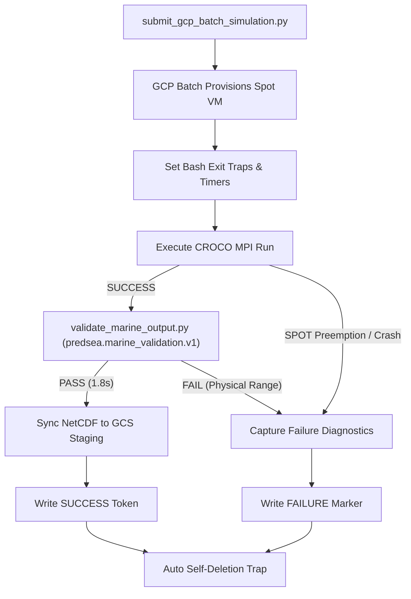

# 05. Cloud Deployment & Serverless Operations

This document describes the cloud-native, serverless execution framework developed for **PredSea** using **Google Cloud Platform (GCP) Batch**, **Spot VM instances**, and automated cost-protection mechanisms.

---

## 1. Containerized HPC Engine (`croco-batch`)

Rather than maintaining dedicated, static HPC server hardware, the entire numerical modeling environment—including compiled Fortran 90 binaries for CROCO 2.1.3 and SWAN 41.45, OpenMPI execution runtimes, NetCDF C/Fortran libraries, and Python spatial post-processors—is encapsulated in an immutable Docker container image (`simulation/marine/croco/Dockerfile.batch`).

```
+-----------------------------------------------------------------------------------+
|               PredSea Unified HPC Container Architecture                          |
|                                                                                   |
|  +-----------------------------------------------------------------------------+  |
|  | Base OS: Ubuntu 22.04 LTS + OpenMPI 4.1 + gfortran / gcc                      |  |
|  +-----------------------------------------------------------------------------+  |
|  | Compiled Binaries (one CROCO binary per region, built in a Dockerfile loop): |  |
|  |  - /usr/local/bin/croco_balearic_1km, croco_alboran_1km, croco_algerian_1km, |  |
|  |    croco_gulf_of_lion_1km, croco_tyrrhenian_1km (region-specific LM/MM/N)    |  |
|  |  - SWAN binary (swan.exe/swanrun) is region-agnostic; bathymetry is what's   |  |
|  |    per-region — all 5 regions' SWAN bathymetry grids are COPY'd into the     |  |
|  |    image at build time (see docs/bathymetry-integration-guide.md)           |  |
|  +-----------------------------------------------------------------------------+  |
|  | Python Environment: Python 3.11 + NetCDF4 + xarray + SciPy + NumPy           |  |
|  +-----------------------------------------------------------------------------+  |
|  | Automation Scripts:                                                         |  |
|  |  - run_marine_simulation.py  (Master entrypoint; --model croco or --model=  |  |
|  |    swan — `--model=both` is intentionally hard-disabled, see Section 2)     |  |
|  |  - prepare_croco_forcing.py / prepare_croco_bulk_forcing.py (forcing prep)   |  |
|  |  - validate_marine_output.py  (Dimension-aware C-grid physical validator)    |  |
|  +-----------------------------------------------------------------------------+  |
+-----------------------------------------------------------------------------------+
```

The image is pinned by digest (not by mutable tag) in every real Batch submission, since digests can drift as the image is rebuilt:
`europe-west1-docker.pkg.dev/predsea-api/predsea-simulations/croco-batch@sha256:f8313ce5d43624d055321ba769f7a7da315c6aad5c7e16c30ab10ba063953ba8`

This is the digest confirmed, this development cycle, to be built from a Dockerfile that compiles both CROCO and SWAN from source and bakes in per-region bathymetry for all 5 Western Mediterranean regions. This particular digest also carries two 2026-07-29 SWAN fixes (an explicit error when a boundary's walk-inward substitute exceeds 30% of that edge's grid size, and the addition of `PROP BSBT` to SWAN's numerical scheme for geometrically constrained domains — both described in `02_modeling_suite.md` §§4.4–4.5) and the regenerated Gulf of Lion CROCO grid/binary (`LM=498, MM=198`, also §4.4). `submit_gcp_batch_simulation.py` refuses to submit a real (non-dry-run) job unless `--image-uri` contains an explicit `@sha256:` digest. Full end-to-end confirmation that SWAN actually runs successfully against real bathymetry for all 5 regions is still open — see `04_empirical_validation.md` for the current, in-progress validation status.

---

## 1a. Orchestration Entry Point and the WRF → CROCO → SWAN Sequence

The daily/gate pipeline is not submitted by hand region-by-region. A single Cloud Build job invokes `scripts/daily_orchestrator.py --use-gcp-batch`, which drives the full sequence:

1. **Boundary/credential fetch**: ECMWF and CMEMS forcing are downloaded first. Copernicus, AEMET, and SOCIB credentials are pulled from Secret Manager at build time (`availableSecrets`/`secretEnv` in the Cloud Build config) rather than from a local `.env` file, since `humanintheloop/.env` is git-ignored and never reaches Cloud Build's source upload. Builds run as the Compute Engine default service account, not the legacy Cloud Build SA — that account is what needs `roles/secretmanager.secretAccessor`.
2. **Shared WRF run**: a single Spot/on-demand VM runs WRF once for atmospheric forcing. Every region's CROCO/SWAN job reads from this same WRF output — WRF is never run per-region.
3. **CROCO phase**: once WRF completes, a CROCO Batch job is submitted for every configured region simultaneously (5 jobs × 16 vCPU `c2d-highcpu-16` = 80 vCPU), and the orchestrator polls each job's real Batch state plus a `CROCO_SUCCESS` GCS marker until all regions finish.
4. **SWAN phase**: only after every region's CROCO job succeeds does the orchestrator submit SWAN as a second, separate phase across all regions, polling the same way for a `SUCCESS` marker.

Two phases instead of one combined submission exist for two independent reasons:

* `run_marine_simulation.py --model=both` is a hard, permanent `parser.error()` (exit code 2) — CROCO and SWAN must always run as separate Batch jobs, never combined in one container invocation.
* The project's `CPUS_ALL_REGIONS` quota is a single **global** 64 vCPU cap shared by the WRF VM and every Batch job across every phase — it is not a per-phase or per-region allowance. 5 regions' CROCO jobs alone (5 × 16 vCPU = 80 vCPU) already exceed it, so in practice some regions' jobs queue for capacity rather than all starting immediately (a multi-minute `CPUS_ALL_REGIONS` quota wait per region has been observed in production runs). Splitting CROCO and SWAN into two sequential phases avoids also stacking all 10 region×model jobs at once (160 vCPU), but does not remove the queuing itself.

Any region is mandatory within its phase — a submission or completion failure for one region aborts the whole run rather than silently publishing a partial result. This is not just a design description: a 2026-07-29 3-region validation test was aborted mid-run when `gulf_of_lion_1km`'s SWAN job failed, and the other two regions' still-running SWAN jobs (`alboran_1km`, `algerian_1km`, each past 3.5 hours at that point) were orphaned as a result rather than left to finish — see `04_empirical_validation.md` for the current status of that test.

### Timeout budgets: the WRF VM timeout and the Batch-phase timeout are now decoupled

Until 2026-07-29, `daily_orchestrator.py` computed a single `timeout_hours` value from the forecast horizon (`max(4.0, (forecast_hours / 24) * 1.25)`, flooring at 4.0h for short horizons) and reused it for two unrelated things: the WRF VM's own timeout, and the combined CROCO+SWAN Batch-phase timeout. This caused a real production incident: a live 6-hour-forecast test run was killed by the shared 4-hour ceiling while 3 of the 5 regions' SWAN jobs were still legitimately in progress — not hung, just needing more than 4 hours combined for CROCO+SWAN across all regions.

The fix adds a separate function, `batch_pipeline_timeout_hours()` (floor of 8.0h, scaling with forecast horizon), used only for the Batch phase and for each Batch job's own `maxRunDuration`, fully decoupled from the WRF VM's own timeout. `cloudbuild.6h-gate.yaml`'s own Cloud Build step timeout was also bumped from 6 hours (`21600s`) to 14 hours (`50400s`) — the old ceiling would otherwise have killed the entire build before the new, larger internal timeout could ever matter, since WRF (up to ~4h) plus the Batch phase (up to ~8h) can now total up to 12h in the worst case.

---

## 2. Dynamic Resource-Aware Compute Sizing & Regional Matrix

To prevent Out-Of-Memory (OOM) failures while minimizing compute expenditure, the submission orchestrator [`scripts/submit_gcp_batch_simulation.py`](file:///Users/charles.santana/PredSea/predsea-system/scripts/submit_gcp_batch_simulation.py) provisions compute resources according to regional grid point densities:

$$\text{Grid Points} = \left( \frac{(\text{Lat}_{\text{max}} - \text{Lat}_{\text{min}}) \times 111,000}{H_{\text{res}}} \right) \times \left( \frac{(\text{Lon}_{\text{max}} - \text{Lon}_{\text{min}}) \times 111,000 \times \cos(\text{Lat}_{\text{mid}})}{H_{\text{res}}} \right)$$

### Regional Deployment Specifications (Western Mediterranean Suite)

`calculate_resources()` in `submit_gcp_batch_simulation.py` auto-derives machine sizing from each region's grid point count, but its "small tile" and "medium tile" branches currently return identical values — so every real submission this cycle has passed explicit CLI overrides to get the proven configuration below, rather than relying on the auto-sizing:

| Region ID | Grid Points | Machine Type | MPI Ranks | Compute Spec | Provisioning |
| :--- | :---: | :---: | :---: | :---: | :---: |
| **Balearic 1km** | $200,901$ | `c2d-highcpu-16` | 16 | 16 vCPU / 32 GiB | STANDARD |
| **Alboran 1km** | $124,203$ | `c2d-highcpu-16` | 16 | 16 vCPU / 32 GiB | STANDARD |
| **Gulf of Lion 1km** | $121,649^*$ | `c2d-highcpu-16` | 16 | 16 vCPU / 32 GiB | STANDARD |
| **Tyrrhenian 1km** | $391,379$ | `c2d-highcpu-16` | 16 | 16 vCPU / 32 GiB | STANDARD |
| **Algerian 1km** | $282,273$ | `c2d-highcpu-16` | 16 | 16 vCPU / 32 GiB | STANDARD |

*Gulf of Lion's Grid Points figure above predates the 2026-07-29 bbox resize (`02_modeling_suite.md` §4.4) and has not been recomputed against the new bbox (`latitude_max` now $43.3^\circ$ instead of $44.5^\circ$); it is left as-is here rather than replaced with an invented number, but should not be treated as current. Machine sizing (16 vCPU) was set via explicit CLI override in any case, not derived from this figure.

`STANDARD` (on-demand) provisioning was chosen deliberately over `SPOT` for these validation runs: `SPOT` capacity draws from the same single global `CPUS_ALL_REGIONS` quota pool (64 vCPUs for the whole project, covering the WRF VM and every Batch job together — see Section 1a), and deadline-critical gate testing needs guaranteed capacity rather than preemption risk. `SPOT` remains the CLI default in `submit_gcp_batch_simulation.py` and is the intended cost-saving mode once the pipeline is stable enough to tolerate retries.

---

## 3. Spot VM Preemptibility & Cost Safety Traps

`SPOT` VM pricing is **70%–90%** cheaper than on-demand, and is the long-term target once this pipeline no longer needs deadline-guaranteed capacity (see Section 2). The fault-tolerance mechanisms below apply regardless of provisioning model:



1.  **Automated Self-Deletion Traps**: Compute nodes automatically self-destruct upon task exit, eliminating idle VM billing risks.
2.  **In-Cloud Validation Gate**: All assertions (`validate_marine_output.py`) run in-cloud directly inside the container before storage sync, requiring zero local downloads.
3.  **Run-Scoped Immutability**: Forecast outputs are committed to immutable GCS storage paths:
    `gs://predsea-daily-outputs-test/predictions/YYYY-MM-DD/runs/[RUN_ID]/`
